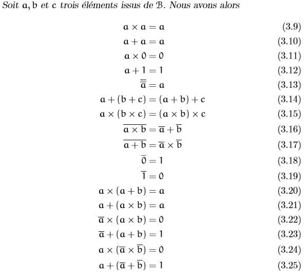

# Math info
## Logic

## Calcul booléen
### Axiomes du calcule boléen
- a x 1 = a
- a + 0 = a
- a x b = b x a
- a + b = b + a
- a x (b + c) = (a x b) + (a x c)
- a + (b x c) = (a + b) x (a + c)
- a x -a = 0
- a + -a = 1

###  Propriétés du calcul booléen

### Formes normales
 - Conjonctive "^"
  - ex: (a . b . c)
 - Disjonctive "v"
  - ex: (a + b + c)

## Codages

### La Matrice de paritée
 - La matrice deparitée, notée **P**, est un matrice à **n** *lines* et **p - n** *colones* qui explicite les bits de contrôle ajoutés à la fin de chaque mot de la base canonique de B^n.

### Matrice génératrice
 - La matrice génératrice G est la juxtaposition d'une matrice identité de dimension n et de la matrice de parité.
 - **G=(I P)**

### Matrice de contrôle
 - La Matrice de contrôle **H** est la juxtaposition de la matrice de parité **transposée** et d'une matrice identité de dimension (p - n).
 - **H = (P' I p-n)**

### Le syndrome
 - Le syndrome d'un message **m**, noté **σ(m)**
 - **σ(m)** = m*H' ou H est la matrice de contrôle.

### [Matrice identité](https://fr.wikipedia.org/wiki/Matrice_identit%C3%A9)

### [Base canonique](https://fr.wikipedia.org/wiki/Base_canonique)
- La base canonique est par exemple dans b4
  - 1000
  - 0100
  - 0010
  - 0001

### [Transposé d'un matrice](https://fr.wikipedia.org/wiki/Matrice_transpos%C3%A9e)

### Code de hamming
 - δ (la distance minimal du code) est = 3
